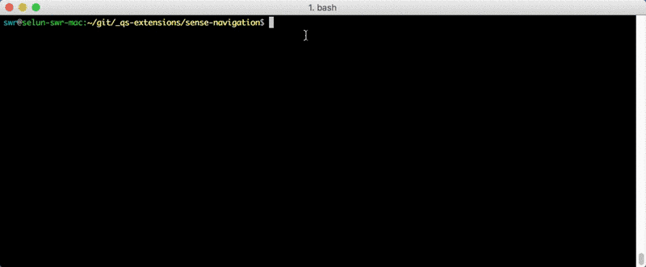

<p align="center">
  <a href="https://stefanwalther/sense-go">
    
  </a>
  <p align="center">Validate, package and deploy your Qlik Sense Visualization Extension projects with ease.</p>
</p>

[](https://david-dm.org/stefanwalther/sense-go)
[](https://travis-ci.org/stefanwalther/sense-go)

## Motivation
Main purpose of this library is to provide a framework to easily

* prepare
* package and
* deploy

**Visualization Extensions** created for Qlik Sense.

The implementation is a based on the deployment functionality in the [Yeoman Generator for Visualization Extensions](https://github.com/stefanwalther/generator-qsExtension).

The main reason behind creating this library is that I am creating a lot of different visualization extensions for Qlik Sense, but in any of these projects I include some kind of deployment system (so far always using grunt). If I have to make changes to the general deployment approach I have to change every single visualization extension repository, which is not really ideal. So introducing this library centralizes the deployment needs and allows me to re-use a central approach.

Technically speaking ***sense-go*** is just a collection of configurable [gulp tasks](http://gulpjs.com) which can be easily re-used and extended when developing your Qlik Sense visualization extensions.

## What does it do for you?
Imagine you have the following requirements:

- Convert .less to .css
- Import external dependencies like libraries, images, fonts, etc.
- Minify/Uglify all your code
- Package your extension to a .zip file
- Deploy to
  - Qlik Sense Deskto
  - To a Qlik Sense server
  - To a remote machine
- Publishing to npm
- Watch changes and automatically re-run building & packaging

sense-go does all this for you as one very simple command line tool, fully configurable to meet your needs:



## Installation
### Prerequisites
sense-go is built on top of [Node.js](https://nodejs.org/en/)

### Package installation
Install sense-go as a global package

```js
$ npm install -g sense-go
```

## Usage
There are basically three different approaches to use **sense-go**.

- **CLI with default configuration:** Just run `sense-go` in the command line and use the default settings and [follow the conventions](#conventions)
- **CLI with custom configuration:** Place a `.sense-go.yml` file into the root folder of your project and customize the settings, then just run `sense-go`
- **Programmatic usage:** Place a `sense-go.js` file into the root folder of your project, load the default tasks and add custom tasks, then just run `sense-go`

### CLI with default configuration

Nothing special to explain, just run `sense-go` in the command line in the root of your project.
The default configuration will be considered. Also have a look at 

### CLI with custom configuration
Place a `.sense-go.yml` file in the root folder of your project:

The easiest way to start with your custom configuration is to copy the [default configuration file](src/default-config.yml) and start modifying it.
But keep in mind, following the conventions, you should only need to adapt a few of the default configurations.

### Programmatic usage
If you want to add custom gulp tasks, this is the way to go.

- Create a file `sense-go.js` in the root of your project based on the following skeleton:

```js
'use strict';
var senseGo = require( 'sense-go' );
var gulp = senseGo.gulp; // Get the reference to the gulp instance used in sense-go

senseGo.init( function () {

	// Now all default tasks are loaded, can be modified or new ones can be added
	
	// Run your tasks, e.g. with
	gulp.series(['build']);
	
});
```

#### Pass in a custom configuration as object

In your sense-go.js pass in a custom configuration object to `senseGo.init` as follows:

```js
'use strict';
var senseGo = require('./lib/');

var customConfig = {
  deployment: {
    toLocal: {
      enabled: true
    }
  }
}

// customConfig will be used to overwrite existing settings from the default-settings.
// Any setting not being defined in your custom configuration will be taken from the default settings.
senseGo.init( customConfig, function () {
  
  
});
```

#### Load configuration from a file:

```js
'use strict';
var senseGo = require('./lib/');

var customConfig = senseGo.loadYml( path.join(__dirname, 'custom-config.yml'));

senseGo.init( customConfig, function () {
  
  
});
```

### Add custom tasks

```js

'use strict';
var senseGo = require('./lib/');
var gulp = senseGo.gulp; // Get the reference to the gulp instance used in sense-go

senseGo.init( function () {

	// Create a new custom task
	gulp.task('custom', function( done ) {
		console.log('Custom Task');
		done();
	});
	
	// Create a custom task chain, re-using 'build'
	gulp.task('customBuild', gulp.series(['custom', 'build']));
	
	// Run it ...
	gulp.series('customBuild')();
	
});
```

## Conventions
The entire concept follows conventions (or best practices) being used when setting up a project:

```
| PROJECT-ROOT
|-- build			<= all builds, including source code or zipped files
    |-- dev			<= target for the development build
    |-- release		<= target for the release build
|-- docs			<= documentation files, then used by verb
|-- src				<= all source files
    |-- lib
		|-- css		<= see below *
        |-- less    <= less files
| .sense-go.yml		<= sense-go configuration file (OPTIONAL)
| .verb.md			<= verbs readme template
| package.json
```

\* If using less files is preferred for a project, I keep this folder empty, otherwise all the .css files will be place here

***sense-go*** works best if you follow these conventions, but everything is configurable, it's just a bit more work to get ***sense-go*** running.

## Basic workflow
The workflow of the pre-configured tasks can be summarized as follows:

- You **develop** in the `.src` folder
- Whenever you want to **test or deploy**, use a one-liner in your command line: `sense-go`
  - This will
    - Convert `.less` files to `.css` files
    - Lint, Minify, Ugilify the output
    - Create a .zip file to distribute your visualization extension
    - ... a lot of other neat tasks ... fully customizable ...
- Then the **extension is automatically being deployed**
  - To the local extension directory (Qlik Sense Desktop)
  - Imported to the Qlik Sense Server (using the Qlik Sense Repository API)
  - to other destinations, like via SSH
- You can test the extension

It is important to mention that you can by 100% re-define the workflow and also all default settings, but the idea of **sense-go** is really to get something up and running across different projects with as little configuration and development work as possible. **So choose custom configurations wisely.**

### Behind the scenes
Behind the scenes the following happens:

- All relevant content of the src folder is copied to a temporary folder .tmp
- Then in the .tmp folder some transformation of existing files happens
- As soon as this is done, files are copied to a .build folder ( .build/dev in case of the dev strategy, .build/release in case of the release strategy)
- Then the enabled deployment tasks start
  - Copy all files to the local Qlik Sense Desktop
  - Deployment to any server using the QRS API
  - Deployment to any other server using SSH
- (All temporary folders (like .tmp) are deleted)

## Tasks
There are three categories of tasks:

- **Building:** Build the solution (either for debugging or release) before you deploy.
- **Deployment:** Deploy the solution to different targets.
- **Publishing & Tools:** Some helpers to publish the solution.

### Building
#### Clean
> Cleaning and deleting folders.

**`clean:tmp`**
* Delete the entire `.tmp` directory.
* Options used:
  * `tmpDir`

**`clean:buildDev`**
* Deletes all files in the `./build/dev` directory.
* Options used:
  * `buildDevDir`

**`clean:buildRelease`**
* Deletes all files in the `./build/release` directory.
* Options used:
  * `buildReleaseDir`

**`clean:localExtensionDir`**
* Deletes all files in the project's local extension folder. Only makes sense if using deployment to a local Qlik Sense Desktop. 
* Disabled if `deployment.toLocal.enabled === true`.
* If working on Windows `deployment.toLocal.extensionBaseDir` will be determined automatically.
* Options used:
  * `deployment.toLocal.enabled`
  * `deployment.toLocal.extensionBaseDir`

**`clean:tmpIllegal`**
* Clean all files in the `.tmp` directory which are not supposed to be deployed to the extension directory.
* These are all files, except files with the following file extension: 
  * `{png,jpg,jpeg,json,qext,txt,js,css,eot,svg,ttf,woff,html,htm,wbl,svg}`

#### Copy
> Copy files to a specific directory.

**`copy:toTmp`** 
* Copies all files (except the excluded ones) from the `src` folder to the `.tmp` folder.
* Options used:  
  * `srcDir`
  * `tmpDir`
* Excluded files:  
  * `*.less`

**`copy:tmpToDev`** 
* Copies all files (except the excluded ones) from the `.tmp` folder to `.\build\dev` folder.
* Options used:  
  * `tmpDir`
  * `buildDevDir`
* Excluded files:  
  * `*.less`

**`copy:tmpToRelease`** 
* Copies all files (except the excluded ones) from the `.tmp` folder to `.\build\release` folder.
* Options used:  
  * `tmpDir`
  * `buildReleaseDir`
* Excluded files:  
  * `*.less`

#### Import
> Import files to the deployment.

**`import`**
The main use-case behind the `import` task is to be able to import "external" files from external dependencies (e.g. node_modules or bower) into the .tmp directory to use them in the solution.

Define the file you want to import in your `.sense-go.yml` file as follows:

Example:

```
import:
  files:
    - ["./node_modules/d3/d3.min.js", "./.tmp/lib/external/d3/d3.min.js"]
    - ["./node_modules/moment/min/moment.min.js", "./.tmp/lib/external/moment/moment.min.js"]
```

#### Replace
> Replaces string patterns in text files across the project.

**`replace:tmp`**
* Use `@@ to prefix the key to be replaced with a given value in the source code
* Replacements will only be performed in the following file types: 
  * .html
  * .js
  * .json
  * .qext
  * .txt
  * .xml
  * .yml
 
**Using data from package.json**
All keys from your package.json file are available out of the box if you use the prefix `pkg`

* To get the version, use `@@pkg.version`
* To the get name, use `@@pkg.name`
* etc.

Example:

```js

console.log('Extension @@pkg.name, version @@pkg.version');

```

with the following package.json

```js
{
  "name": "my-extension",
  "version": "0.1.12"
}

```

will return

```js
Extension my-extension, version 0.1.12
```

**Builtin patterns**
The following patterns are available out of the box:

- `@@timestamp` - Defaults to new Date().getTime()

  
**Adding replacement patterns**
Add new replacements patterns in your .sense-go.yml file:

```
replacements:
  custom:
    test1: bla bla
  custom2:
    var1: true
    var2: "Whatever comes here"
```

Then in your e.g. JavaScript file use the replacements:

```js
console.log('custom.test1', '@@custom.test1');
console.log('custom2.var2', '@@custom2.var1');
console.log('custom2.var2', '@@custom2.var2');
```

Will return:

```
bla bla
true
Whatever comes here
```

#### Less
> Converts .less files to .css files.

All less tasks automatically autoprefix (using [gulp-autoprefixer](https://github.com/sindresorhus/gulp-autoprefixer))

**`less:reduce`**
* Uses `/src/less/main.less`, resolves all its dependencies and creates `/.tmp/css/main.css`
* Options used:  
  * `lessReduce.src`
  * `lessReduce.dest`

**`less:each`**
* Converts every `.less` file from the source directory to a corresponding .css file in the .tmp directory.
* Options used:  
  * `lessEach.src`
  * `lessEach.dest`

#### Uglify
> Uglify & minifies JavaScript files

**`uglify:tmp`**
* Uglify all JavaScript files.
* Options:  
  * `tmpDir`
  * `uglify*` - All options directly passed to `gulp-uglify`, e.g.
    * `uglify.mangle`
    * `uglify.beautify`
    * `uglify.preserveComments`
* Excluded:  
  * All files matching the pattern `*.min.js`

#### Minification/Optimization
> Several minification tasks

**`htmlmin:tmp`**
* Minifies all htm/html files in the `tmp` folder.
* Options used:  
  * `tmpDir`

**`minify:json:tmp`**
* Minify .json & .qext files.
* Options used:  
  * `tmpDir`

#### Wbfolder
> Create a wbfolder.wbl file to be used in Dev Hub - Extension Editor.

**`wbfolder:tmp`**
* Creates a wbfolder.wbl file in  the `.tmp` directory.
* Options used:  
  * `wbfolder.enabled`- Whether the task is enabled or not, defaults to `true`.
  * `wbfolder.cwd` - Working directory, defaults to `./.tmp`.
  * `wbfolder.src` - Source mask, defaults to `./**/*.*`.
  * `wbfolder.dest` - wbfolder.wbl file destination, defaults to `./.tmp/wbfolder.wbl`.

Note: The `wbfolder.wbl` file is only necessary if you want to allow users to open your visualization extension in Qlik Dev Hub. 
`wbfolder.wbl` is NOT required and necessary to run your visualization extension in Qlik Sense.

#### Zip
> Create .zip files based on the building strategy

**`zip:dev`**
- Creates a zip file following the pattern "%packageName%_dev.zip" (e.g. "my-extension_dev.zip")
- This task is used in the pre-built task-chain build and will create the output of the build-strategy "dev"
* Options used:  
  * `tmpDir`
  * `buildDir`
  * `packageName`
  
**`zip:release`**
- Creates a zip file following the pattern "%packageName%_v%pkg.version%.zip" (e.g. "my-extension_v0.12.1.zip")
- This task is used in the pre-built task-chain release and creates a packaged version of your current version
* Options used:  
  * `tmpDir`
  * `buildDir`
  * `packageName`
  * `pkg.version`

**`zip:latest`**
- Create a zip file following the pattern "%packageName%_latest.zip" (e.g. "my-extension_latest.zip")
- Useful to have a provide a link to the always latest version
* Options used:  
  * `tmpDir`
  * `buildDir`
  * `packageName`

### Deployment

### Publishing & Tools
#### Bump
> Bumps the version in your package.json file

**`bump:patch`**
* Changes the version in package.json from `0.2.1` to `0.2.2`
* Shortcuts: `sense-go b` or `sense-go b:p` 

**`bump:minor`** 
* Changes the version in package.json from `0.2.1` to `0.3.1`
* Shortcut: `sense-go b:min`

**`bump:major`**  
* Changes the version in package.json from `0.2.1` to `1.0.0`
* Shortcut: `sense-go b:maj`

**`bump:version`** 
* Set the package.json version to a specific value given by the parameter `--newversion` resp. `--nv`.
* Shortcut: `sense-go b:v`

Example:  
 
```sh
$ sense-go bump:version --newversion=0.1.0
$ sense-go b:v --nv=0.1.0
```

**Possible command line parameters** 

**`--tag`**  
* Tags the current version of your commit with the newly created version created by any of the bump-tasks.

**`--commit="Your commit message"`**  
* Commits all files with the given commit message, if no commit message is defined, "." will be committed as a message.

## Task Chains
Based on gulp tasks provided by ***sense-go*** you can then create your task chains.
Some are already predefined:

**`sense-go build`**

```js
  gulp.task( 
    'build', 
    gulp.series( 
      'init', 
      'clean:tmp', 
      'copy:toTmp', 
      'replace:tmp', 
      'clean:buildDev', 
      'copy:tmpToDev', 
      'clean:localExtensionDir', 
      'deploy:tmpToLocal' 
      )
  );`
```

## Create your own task-chains
You can add additional tasks on top of sense-go, mixing your very own tasks with sense-go tasks, etc.

* Always initialize a task chain with the `init` task
* When creating your own tasks, note that sense-go relies on Gulp4

**Example:**

Use your own gulpfile.js (be aware that sense-go uses gulp 4.0 beta):

```js
'use strict';
var senseGo = require( 'sense-go' );
var gulp = senseGo.gulp;
var path = require( 'path' );

var customConfig = senseGo.loadYml( path.join( __dirname, 'custom-config.yml') );

senseGo.init( customConfig,  function (  ) {
  
  gulp.task('myTask', function() {
    ...
  } );
  
  
  // Create your own task chain, and overwrite the current task chain 'build'
  gulp.task( 'build', gulp.series( 
    'init', 
    'clean:tmp', 
    'copy:toTmp', 
    'myTask'        // <== Load your own custom task and mix it with existing ones 
  ) );
  
  // Run your task
  gulp.series(['build'])();
    
});
```

Then run `sense-go build` in the CLI.

## Used Gulp plugins
sense-go is heavily relying on existing gulp plugins. A big thank you to the authors of these plugins!!

### General

* [gulp-babel](https://www.npmjs.com/package/gulp-babel): Use next generation JavaScript, today | [homepage](https://github.com/babel/gulp-babel)
* [gulp-concat](https://www.npmjs.com/package/gulp-concat): Concatenates files | [homepage](https://github.com/wearefractal/gulp-concat)
* [gulp-csslint](https://www.npmjs.com/package/gulp-csslint): CSSLint plugin for gulp | [homepage](https://github.com/lazd/gulp-csslint)
* [gulp-debug](https://www.npmjs.com/package/gulp-debug): Debug vinyl file streams to see what files are run through your gulp pipeline | [homepage](https://github.com/sindresorhus/gulp-debug)
* [gulp-less](https://www.npmjs.com/package/gulp-less): Less for Gulp | [homepage](https://github.com/plus3network/gulp-less)
* [gulp-load-plugins](https://www.npmjs.com/package/gulp-load-plugins): Automatically load any gulp plugins in your package.json | [homepage](https://github.com/jackfranklin/gulp-load-plugins)
* [gulp-replace](https://www.npmjs.com/package/gulp-replace): A string replace plugin for gulp | [homepage](https://github.com/lazd/gulp-replace)
* [gulp-rimraf](https://www.npmjs.com/package/gulp-rimraf): rimraf plugin for gulp | [homepage](https://github.com/robrich/gulp-rimraf)
* [gulp-simple-task-loader](https://www.npmjs.com/package/gulp-simple-task-loader): A simple task loader for gulp | [homepage](https://github.com/reaganthomas/gulp-simple-task-loader)
* [gulp-watch](https://www.npmjs.com/package/gulp-watch): Watch, that actually is an endless stream | [homepage](https://github.com/floatdrop/gulp-watch)

### Validation

* [gulp-csslint](https://www.npmjs.com/package/gulp-csslint): CSSLint plugin for gulp | [homepage](https://github.com/lazd/gulp-csslint)
* [gulp-htmllint](https://www.npmjs.com/package/gulp-htmllint): Check HTML code style with htmllint | [homepage](https://github.com/yvanavermaet/gulp-htmllint)
* [gulp-jsonlint](https://www.npmjs.com/package/gulp-jsonlint): A jsonlint plugin for Gulp | [homepage](https://github.com/rogeriopvl/gulp-jsonlint)

### Packaging

* [gulp-htmlmin](https://www.npmjs.com/package/gulp-htmlmin): gulp plugin to minify HTML. | [homepage](https://github.com/jonschlinkert/gulp-htmlmin)
* [gulp-uglify](https://www.npmjs.com/package/gulp-uglify): Minify files with UglifyJS. | [homepage](https://github.com/terinjokes/gulp-uglify/)
* [gulp-zip](https://www.npmjs.com/package/gulp-zip): ZIP compress files | [homepage](https://github.com/sindresorhus/gulp-zip)

### Transpilation
[babel](https://www.npmjs.com/package/babel): Turn ES6 code into readable vanilla ES5 with source maps | [homepage](https://babeljs.io/)

## Contributing
Pull requests and stars are always welcome. For bugs and feature requests, [please create an issue](https://github.com/stefanwalther/sense-go/issues).
The process for contributing is outlined below:

1. Create a fork of the project
2. Work on whatever bug or feature you wish
3. Create a pull request (PR)

I cannot guarantee that I will merge all PRs but I will evaluate them all.

## Author
**Stefan Walther**

* [qliksite.io](http://qliksite.io)
* [twitter/waltherstefan](http://twitter.com/waltherstefan)
* [github.com/stefanwalther](http://github.com/stefanwalther)

## License
Copyright © 2016, [Stefan Walther](https://github.com/stefanwalther).<br/> 
Released under the MIT license.

***

_This file was generated by [verb](https://github.com/verbose/verb), v0.9.0, on July 16, 2016._
